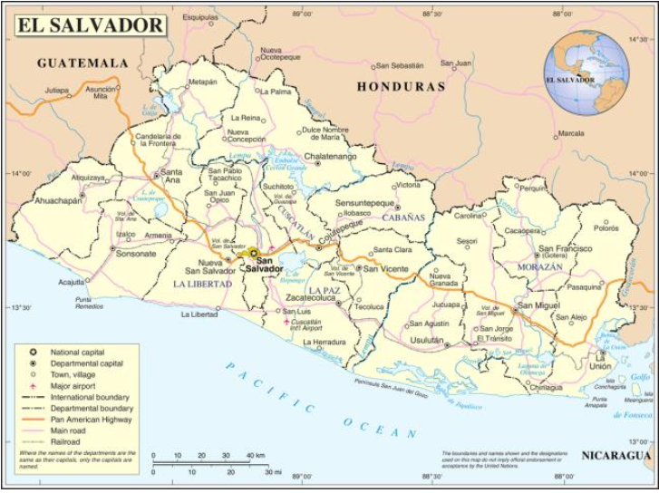
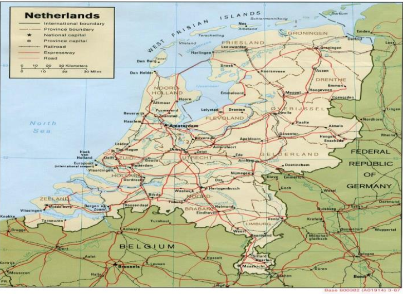
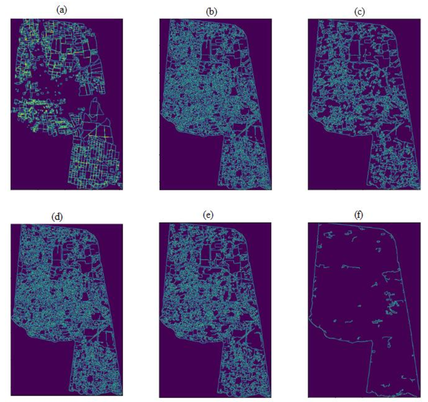
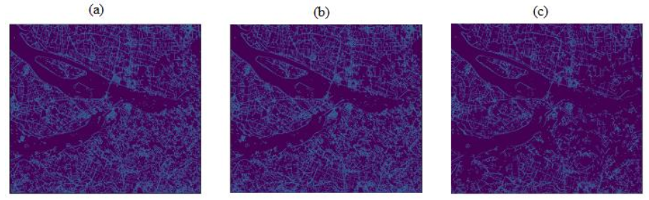
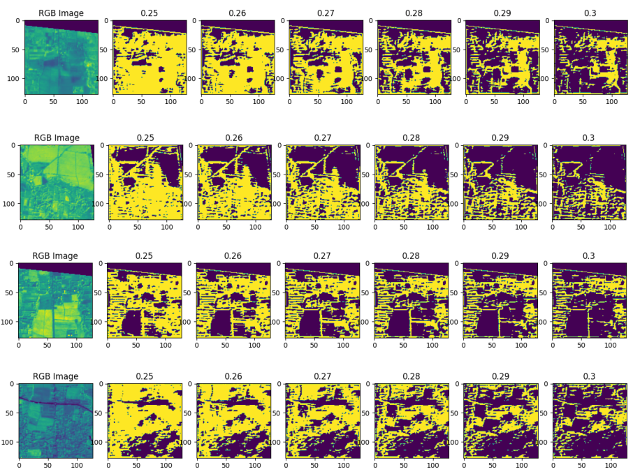
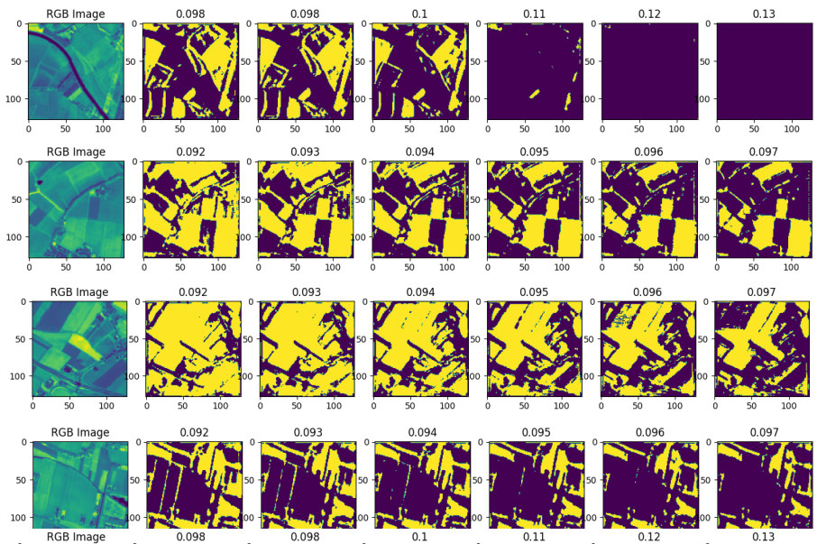

# Automatic Segmentation of Agricultural Plots With Artifitial Intelligence With Satelital Data

This repository contains the implementation of two algorithms and/or methodologies for the identification of agricultural parcels. One of them is based on the development and use of one of the best known edge detection algorithms: The Canny Algorithm. And the other one, the construction of a convolutional neural network in charge of learning the characteristics of the edges and segmenting the plots.

You can find the paper in which the work has been done in the following link, where, along with the complete research, you can find a step by step detail of how each of the implementations were built.

[Full Paper](Paper/Tesis-Segmentacion-Automatica-de-Parcelas-Agricolas-con-Inteligencia-Artificial-en-Datos-Satelitales.pdf)

Similarly, to support the replication of the implementations, it is possible to find the [packages](Paper/Requirements.md) used together with their versions.

___

## Study Areas

El Salvador is a country located in Central America, between the north and south of the American continent.
the north and south of the American Continent, bordered to the west by Guatemala, to the north by Honduras, to the east by Honduras and Nicaragua in the Gulf of Fonseca, and to the south by the Gulf of Fonseca.
Honduras, to the east with Honduras and Nicaragua in the Gulf of Fonseca and to the south with the Pacific Ocean.
Pacific Ocean to the south. With a territorial extension of approximately 21,040.79 square kilometers, El Salvador is located at the latitude of the Pacific Ocean.
Salvador is located in the northern hemisphere latitude, being its geographic coordinates between 13° and 14° latitude.
between 13° and 14° north latitude and between 87° and 90° west longitude.

The Netherlands is a Western European state on the North Sea,
located between the countries of Belgium and Germany. It is a very flat country, with half of its territory below sea level and two
of its territory below sea level and two fifths of it located between 0 and 5 meters above sea level, with its highest point being between 0 and 5 meters above sea level.
above sea level, with its highest point in the province of Limburg, reaching 321 meters above sea level.
reaching 321 meters above sea level. It has an approximate surface of a combined
of 33,893 square kilometers of land and 7,650 square kilometers of water.

## Results

### Canny Algorithm

